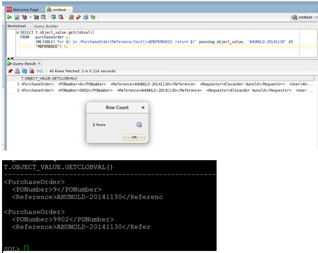

# Oracle XML  

## Introduction

This lab walks you through the steps of inserting and updating xml data. We can add a row to our xml table purchaseorder using insert query. Also we can use Oracle UPDATEXML function to update XML content stored in Database.

### Before You Begin

This lab assumes you have completed the following labs:
- Lab 1:  Login to Oracle Cloud
- Lab 2:  Generate SSH Key
- Lab 3:  Create Compute instance 
- Lab 4:  Environment setup
- Note :  All scripts for this lab are stored in the /u01/workshop/xml folder and are run as the oracle user. 
  
 
## Step 1:	Get the list of the customer and their purchased information from a geo graphical location 
    
  XMLEXISTS is an SQL/XML operator that you can use to query XML values in SQL, in a regular query I can use the xmlexists function to look if a specific value is present in an xmltype column
    
  ````
    <copy>
    SELECT t.object_value.getclobval() FROM   purchaseorder t
    WHERE xmlexists('/PurchaseOrder/ShippingInstructions/Address[city/text()=$CITY]' passing object_value, 'South San Francisco' AS "CITY" );

      </copy>
   ````
 
   

  **Notes:** XMLEXISTS is an SQL/XML operator that we can use to query XML values in SQL, in a regular query we can use the xmlexists function to look if a specific value is present in an xmltype column.

## Step 2: Customer purchase history  
    
  XMLTABLE: Convert XML Data into Rows and Columns using SQL. The XMLTABLE operator, which allows you to project columns on to XML data in an XMLTYPE , making it possible to query the data directly from SQL as if it were relational data.

  ````
    <copy>
    SELECT t.object_value.getclobval()
    FROM   purchaseorder p,
    XMLTABLE('for $r in /PurchaseOrder[Reference/text()=$REFERENCE] return $r' passing object_value, 'AHUNOLD-20141130' AS  "REFERENCE") t;  

      </copy>
   ````
  
   

  **Notes:** The XMLTABLE operator, which allows you to project columns on to XML data in an XMLTYPE , making it possible to query the data directly from SQL as if it were relational data.
   

## Step 3: Listing the product description those unit price matches to ‘$xx’
    

 XMLSERIALIZE is a SQL/XML operator that you can use to convert an XML type to a character type.

  ````
    <copy>
    SELECT XMLSERIALIZE(CONTENT COLUMN_VALUE AS CLOB INDENT SIZE=2)
FROM  Purchaseorder p,
      XMLTable(
        '&lt;Summary&gt;
         {
          for $r in /PurchaseOrder/LineItems/Part
          return $r/Description
         }
         &lt;/Summary&gt;'
         passing object_value
      )
WHERE xmlexists('/PurchaseOrder/LineItems/Part[UnitPrice/text()=$UnitPrice]' passing object_value, '27.95' AS "UnitPrice" );

      </copy>
  ````
  
  
    
   **Notes:** XMLSERIALIZE is a SQL/XML operator that you can use to convert an XML type to a character type.

## Step 4: Customer order summary – Cost center wise 
    
  XMLQUERY lets you query XML data in SQL statements. It takes an XQuery expression as a string literal, an optional context item, and other bind variables and returns the result of evaluating the XQuery expression using these input values. XQuery string is a complete XQuery expression, including prolog.

   ````
    <copy>
    SELECT xmlquery(
        '&lt;POSummary lineItemCount="{count($XML/PurchaseOrder/LineItems/ItemNumber)}"&gt;{
           $XML/PurchaseOrder/User,
           $XML/PurchaseOrder/Requestor,
           $XML/PurchaseOrder/LineItems/LineItem[2]
         }
         &lt;/POSummary&gt;'
        passing object_value AS "XML"
        returning content
      ).getclobval() initial_state
FROM  PURCHASEORDER
WHERE xmlExists(
        '$XML/PurchaseOrder[CostCenter=$CS]'
         passing object_value AS "XML",
                 'A90' AS "CS"      )
                 /
      </copy>
  ````
  
  

  **Notes:** XMLQUERY lets you query XML data in SQL statements. It takes an XQuery expression as a string literal, an optional context item, and other bind variables and returns the result of evaluating the XQuery expression using these input values. XQuery string is a complete XQuery expression, including prolog.
        
## Step 5: Custer Delivery Priority Instruction for e.g Ex - Courier, Expidite, Surface Mail, Air Mail etc..  
    
  Condition -1: Special_Instructions="Next Day Air 

   ````
    <copy>
    SELECT extractValue(OBJECT_VALUE, '/PurchaseOrder/Reference') "REFERENCE"
    FROM purchaseorder WHERE existsNode(OBJECT_VALUE, '/PurchaseOrder[Special_Instructions="Next Day Air"]')=1;

      </copy>
   ````
  
 
  

  Condition -2: Special_Instructions="Priority Overnight
    
    
 ````
    <copy>
    SELECT extractValue(OBJECT_VALUE, '/PurchaseOrder/Reference') "REFERENCE"
  FROM purchaseorder
  WHERE existsNode(OBJECT_VALUE, '/PurchaseOrder[Special_Instructions="Priority Overnight"]')=1;


      </copy>
  ````
  
  
  
   
  **Notes**: ExistsNodechecks if xpath-expression returns at least one XML element or text node. If so, existsNode returns 1, otherwise, it returns 0. existsNode should only be used in the where clause of the select statement.


## Acknowledgements

- **Authors** - Balasubramanian Ramamoorthy, Arvind Bhope
- **Contributors** - Laxmi Amarappanavar, Kanika Sharma, Venkata Bandaru, Ashish Kumar, Priya Dhuriya, Maniselvan K, Robert Ruppel.
- **Team** - North America Database Specialists.
- **Last Updated By** - Kay Malcolm, Director, Database Product Management, June 2020
- **Expiration Date** - June 2021   

**Issues-**
Please submit an issue on our [issues](https://github.com/oracle/learning-library/issues) page. We review it regularly.
  

