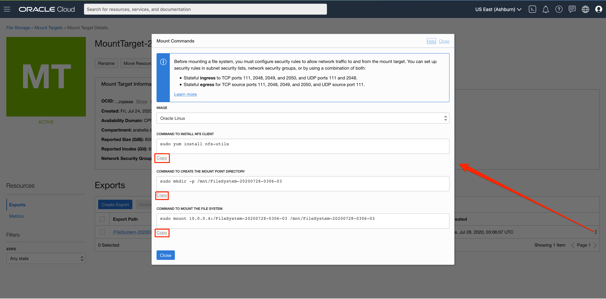

# File System Storage Service

## **Introduction**

Welcome to the Cloud Storage (File System Storage) self-paced lab from Oracle!

Oracle Cloud Infrastructure File Storage Service provides a durable, scalable, distributed, enterprise-grade network file system. You can connect to a File Storage Service file system from any bare metal, virtual machine, or container instance in your Virtual Cloud Network (VCN). You can also access a file system from outside the VCN using Oracle Cloud Infrastructure FastConnect and Internet Protocol security (IPSec) virtual private network (VPN).

### Objectives
- Create and mount File Storage System to a compute instance
- Verify availability of the File Storage system.

### Pre-Requisites
Lab 1: Login to Oracle Cloud  
Lab 2: Create SSH Keys - Cloud Shell

### Recommended Resources
1. [OCI Training](https://cloud.oracle.com/en_US/iaas/training)

2. [Familiarizing with OCI console](https://docs.us-phoenix-1.oraclecloud.com/Content/GSG/Concepts/console.htm)

3. [Overview of Networking](https://docs.us-phoenix-1.oraclecloud.com/Content/Network/Concepts/overview.htm)

4. [Familiarizing with Compartment](https://docs.us-phoenix-1.oraclecloud.com/Content/GSG/Concepts/concepts.htm)

5. [Connecting to a compute instance](https://docs.us-phoenix-1.oraclecloud.com/Content/Compute/Tasks/accessinginstance.htm)

6. Completed **Lab 1: Generate SSH Keys** on the Contents menu on the right

*Note: OCI UI is being updated, thus some screenshots in the instructions may be different from the actual UI*


## Step 1: Create VCN

1. From the OCI Services menu,Click **Virtual Cloud Networks** under Networking. 
    

2. Select the compartment assigned to you from drop down menu on left part of the screen under Networking and Click **Start VCN Wizard**
    

    
    *NOTE: Ensure the correct Compartment is selected under COMPARTMENT list*

3. Click **VCN with Internet Connectivity** and click **Start VCN Wizard**.

4. Fill out the dialog box:

      - **VCN NAME**: Provide a name
      - **COMPARTMENT**: Ensure your assigned compartment is selected
      - **VCN CIDR BLOCK**: Provide a CIDR block (10.0.0.0/16)
      - **PUBLIC SUBNET CIDR BLOCK**: Provide a CIDR block (10.0.1.0/24)
      - **PRIVATE SUBNET CIDR BLOCK**: Provide a CIDR block (10.0.2.0/24)
      - Click **Next**

    


5. Verify all the information and  Click **Create**

    This will create a VCN with following components.

    *VCN, Public subnet, Private subnet, Internet gateway (IG), NAT gateway (NAT), Service gateway (SG)*

6. Click **View Virtual Cloud Network** to display your VCN details.
    

8. In your VCN Details page, click **Security Lists** and then **Default Security list for YOUR\_VCN\_NAME**

     

    **NOTE:** Note down the Subnet and Availability domain.We will create File Storage system and compute instance in the same subnet and Availability domain later on​​.

8. In Security list details page, Click **Add Ingress Rule**. 
    

**NOTE:** You will be adding **FOUR** Ingress Rules so do not Click the blue confirm **Add Ingress Rule** Button until Step 13.

9. Click **+Additional Ingress Rule** and add the first rule for access of NFS and NLM traffic with Destination Port Range of 2048-2050. (Type the values).
    - **Make sure STATELESS Flag in un-checked**
    - **SOURCE TYPE:** CIDR
    - **SOURCE CIDR:** 10.0.0.0/16
    - **IP PROTOCOL:** TCP
    - **SOURCE PORT RANGE:** All
    - **DESTINATION PORT RANGE:** 2048-2050

    

10. Click **+Additional Ingress Rule**  and add the second rule for access of NFS and NLM traffic with Destination Port Range of 2048-2050. (Type the values).

    - **Make sure STATELESS Flag in un-checked**
    - **SOURCE TYPE:** CIDR
    - **SOURCE CIDR:** 10.0.0.0/16
    - **IP PROTOCOL:** TCP
    - **SOURCE PORT RANGE:** 2048-2050
    - **DESTINATION PORT RANGE:** All

    

11. Click **+Additional Ingress Rule** to add third ingress rule allowing traffic to a Destination Port Range of 111 for the NFS rpcbind utility.

    - **Make sure STATELESS Flag in un-checked**
    - **SOURCE TYPE:** CIDR
    - **SOURCE CIDR:** 10.0.0.0/16
    - **IP PROTOCOL:** TCP
    - **SOURCE PORT RANGE:** All
    - **DESTINATION PORT RANGE:** 111

    

12. Click **+Additional Ingress** Rule  to add fourth ingress rule allowing traffic to a Source Port Range of 111 for the NFS rpcbind utility.

    - **Make sure STATELESS Flag in un-checked**
    - **SOURCE TYPE:** CIDR
    - **SOURCE CIDR:** 10.0.0.0/16
    - **IP PROTOCOL:** TCP
    - **SOURCE PORT RANGE:** 111
    - **DESTINATION PORT RANGE:** All

    

13. Click **Add Ingress Rule**

    

## Step 2: Create File System Storage

In this section, we will create File System Storage.

1. Click navigation button to open OCI Services menu. Under **File Storage**, click **File Systems**

    

2. Click **Create File System**

    

3. Under **Export Information**, click **Edit Details**. Change **EXPORT PATH** to an easy-to-remember name.
   
   Under **Mount Target Information**, click **Edit Details**. Click **CREATE NEW MOUNT TARGET**, select the VCN you justed created for **VIRTUAL CLOUD NETWORK**. Choose **Public Subnet-YOUR\_VCN\_NAME (Regional)** for **SUBNET**.
   
   Click **Create**

    

4. OCI console will show your File System details. Under **Exports** Click your mount target name under **Mount Target**. In Mount Target Details page, note down the IP address.

    
    

We now have a File Storage system created. Next we will create a SSH key pair that will be used to login to a compute instance and mount the file system.

## Step 3: Compute instance
1. . Switch to the OCI console. From OCI services menu, Click **Instances** under **Compute**.
    

2. On the left sidebar, select the **Compartment** in which you placed your VCN under **List Scope**. The, Click **Create Instance**. 
      

3. Enter a **Name** for your Instance and the **Compartment** in which you placed your VCN. The select **Show Shape, Network, and Storage Options**. Leave **Image or Operating System** and **Availability Domain** as the default values.
      

4. Scroll down to **Shape** and click **Change Shape**. Select **Virtual Machine** and **VM.Standar2.1**. Click **Select Shape**
      
      

5. Scroll Down to **Configure Networking** and select the following.
      - **Virtual Cloud Network Compartment**: Choose the compartment in whih you created your VCN
      - **Virtual Cloud Network**: The VCN you created in Step 1
      - **Subnet Compartment**: Choose the compartment in whih you created your VCN 
      - **Subnet**: Public Subnet (Which should be named Public Subnet-NameofVCN)
      - **Use network security groups to control traffic**: Un-checked.
      - **Assign a public IP address**: Checked
      - **Boot Volume:**: Leave default
      
      

6. Choose 'Paste SSH Keys' under **Add SSH Keys:** and paste the Public Key saved from Lab 2 and click **Create**.
      

   **NOTE:** If 'Service limit' error is displayed choose a different shape from VM.Standard2.1, VM.Standard.E2.1, VM.Standard1.1, VM.Standard.B1.1 OR choose a different AD.

7. Wait for Instance to be in **Running** state. Then, copy the public IP of the instance. 

      
    **NOTE:** The screenshot shows steps 8-12
8. Open the Oracle Cloud Shell Terminal. Then, enter the Command:

    ```
    <copy>
    cd .ssh
    </copy>
    ```

9. Enter **ls** and verify id\_rsa file exists
    ```
    <copy>
    ls
    </copy>
    ```

10. Enter the command below, replacing <SSH-KEY-NAME> with the name of the ssh key used to create the instance and <PUBLIC_IP_OF_COMPUTE> with the IP address copied in part 7. 

    ```
    <copy>
    bash
    ssh -i SSH-KEY-NAME opc@PUBLIC_IP_OF_COMPUTE
    </copy>
    ```

    *Hint: If 'Permission denied error' is seen, ensure you are using '-i' in the ssh command. You MUST type the command, do NOT copy and paste ssh command.*

11. Enter 'Yes' when prompted 'Are you sure you want to continue connecting (yes/no)?'

12. Verify opc@COMPUTE\_INSTANCE\_NAME appears on the prompt

## **Step 4**: Mount the File System Storage to Compute Instance

Users of Ubuntu and Linux operating systems (we launched a Oracle Linux instance) can use the command line to connect to a file system and write files. Mount targets serve as file system network access points. After your mount target is assigned an IP address, you can use it to mount the file system. You need to install an NFS client and create a mount point. When you mount the file system, the mount point effectively represents the root directory of the File Storage system, allowing you to write files to the file system from the instance.

1. Click the navigation button, under **File Storage**, click **File Systems**. Click your File System. Under **Exports**, click the mount target name under **Mount Target**. Click Action icon on the right, and select **Mount Commands**. Execute the three commands in Mount Commands in your Cloud shell / Terminal. *If you finish this part, you can skip part 2-4 in this Step.*

    
      
2. After you ssh to your compute instance, enter command:

    ```
    <copy>sudo yum install nfs-utils</copy>
    ```
    (This is just to ensure nfs-utils is installed)


3. Enter command:

    ```
    <copy>sudo mkdir -p /mnt/nfs-data</copy>
    ```
    to create a mount point.

4. Mount the file system, enter command:

    ```
    <copy>
    bash
    sudo mount 10.x.x.x:/EXPORT_PATH_NAME /mnt/nfs-data
    </copy>
    ```

    **HINT:** Mount commands can also be seen by Clicking Action icon in File Storage detail, and selecting ‘Mount Commands’.
    

    **NOTE:** The 10.x.x.x should be replaced with the IP of File System Storage. EXPORT\_PATH\_NAME should be replaced with Export path name used earlier. (Example: If 10.0.0.3 is the IP of File System Storage, and '/' is the EXPORT\_PATH\_NAME, then **sudo mount 10.0.0.3:/ /mnt/nfs-data**).

5. Enter command:

    ```
    <copy>df -h</copy>
    ```
    and
    ```
    <copy>mount | grep /mnt/nfs-data</copy>
    ```
    and verify the mounted File System Storage.

    *Note: You may need to change `nfs-data` to the mount point directory you just created.*

     

     

6. Go to your VCN instance, click **Security Lists** and then **Default Security List for YOUR\_VCN\_NAME**. If you do NOT see any Ingress Rule with *ICMP* as IP Protocal and want to ping the mount point, then you can add an Ingress Rule:

      - Source CIDR: 0.0.0.0/0
      - IP Protocol: ICMP
      - Leave other fields blank

    *Note: If you already had one or multiple ICMP Ingress Rules, you can skip this part.*

7. **Optional Step**. Second compute instance can be created and have the same file system mounted on it, following Step 3 and Step 4.

You have now mounted Enterprise grade File System Storage created in OCI to your compute instance. You can place files in this file system. All other VM instances that have mounted this file system will have access to it.

## **Step 5**: Delete the Resources

In this section, we will delete all the resources we created in this lab.

### Delete File System Storage
1. From OCI Services menu, Click **File Systems**, then click your File System name.

2. Under Exports, click the action icon and select **Delete**, and confirm **Delete**.

     

3. Verify there is no data under **Exports**. It may take some time.

4. Click **File Systems** on the top of the page, click the action icon next to your File System, and click **Delete**.

### Delete Compute Instance

1. From OCI services menu, under **Compute**, click **Instances** 

2. Locate your compute instance, click action icon, and then **Terminate**

     

3. Make sure **Permanently delete the attached Boot Volume** is ***checked***, click **Terminate Instance**. Wait for instance to fully terminated

     

### Delete VCN

1. From OCI services menu, under **Networking**, click **Virtual Cloud Networks**. A list of all VCNs will appear.

2. Locate your VCN, click Action icon, and then **Terminate**. Click **Terminate All** in the Confirmation window. Click **Close** once VCN is deleted

     

*Congratulations! You have successfully completed the lab.*

## Acknowledgements

- **Author** - Flavio Pereira, Larry Beausoleil
- **Adapted by** -  Yaisah Granillo, Cloud Solution Engineer
- **Last Updated By/Date** - Arabella Yao, Product Manager Intern, DB Product Management, July 2020

## See an issue?
Please submit feedback using this [form](https://apexapps.oracle.com/pls/apex/f?p=133:1:::::P1_FEEDBACK:1). Please include the *workshop name*, *lab* and *step* in your request.  If you don't see the workshop name listed, please enter it manually. If you would like for us to follow up with you, enter your email in the *Feedback Comments* section.
