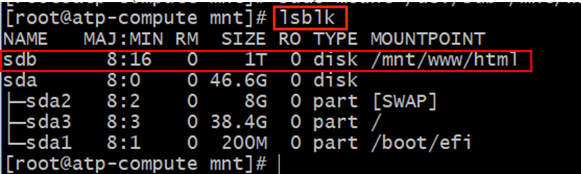

# OCI Quick Start Lab (VCN, Compute and Block Volume)

## Introduction

In this lab we will create a compute instance, install httpd server on it, attach block volume to it, and install an app on the Block Volume
We will then create a second compute instance using the boot volume of the first compute instance and move the Block Volume to the second compute instance (with the app installed).

### Objectives
- Demonstrate launching VCN
- Compute Instance
- Use Boot volume of compute instance
- Move additional storage with applicatons/tools installed between compute instances.

### Pre-Requisites
Lab 1: Login to Oracle Cloud  
Lab 2: Create SSH Keys - Cloud Shell

### Recommended Resources
1. [OCI Training](https://cloud.oracle.com/en_US/iaas/training)
2. [Familiarity with OCI console](https://docs.us-phoenix-1.oraclecloud.com/Content/GSG/Concepts/console.htm)
3. [Overview of Networking](https://docs.us-phoenix-1.oraclecloud.com/Content/Network/Concepts/overview.htm)
4. [Familiarity with Compartment](https://docs.us-phoenix-1.oraclecloud.com/Content/GSG/Concepts/concepts.htm)
5. [Connecting to a compute instance](https://docs.us-phoenix-1.oraclecloud.com/Content/Compute/Tasks/accessinginstance.htm)

## Step 1: Create VCN

1. From the OCI Services menu,Click **Virtual Cloud Network**. Select the compartment assigned to you from drop down menu on left part of the screen under Networking  


2. Click **Start VCN Wizard**.

   **NOTE:** Ensure the correct Compartment is selected under COMPARTMENT list.
   

3. Click **VCN with Internet Connectivity** and click **Start VCN Wizard**.


4. Fill out the dialog box:
   
      - **VCN NAME**: Provide a name
      - **COMPARTMENT**: Ensure your compartment is selected
      - **VCN CIDR BLOCK**: Provide a CIDR block (10.0.0.0/16)
      - **PUBLIC SUBNET CIDR BLOCK**: Provide a CIDR block (10.0.1.0/24)
      - **PRIVATE SUBNET CIDR BLOCK**: Provide a CIDR block (10.0.2.0/24)
      - Click **Next**


5. Verify all the information and  Click **Create**.


6. This will create a VCN with following components.

    *VCN, Public subnet, Private subnet, Internet gateway (IG), NAT gateway (NAT), Service gateway (SG)*

7. Click **View Virtual Cloud Network** to display your VCN details.

             
8. We will open port 80 on this VCN to provide http access to app on the compute instance(to be installed later on. Scroll down and Click **Security List** under **Resources** and then **Default Security list for`<YOUR_VCN_NAME>`**

9. Click **Add Ingress Rule** 

10. Add the following rule under **Ingress Rules**:

      - **Make sure STATELESS is un-checked**
      - **SOURCE TYPE:** CIDR
      - **SOURCE CIDR:** 0.0.0.0/0
      - **IP PROTOCOL:** TCP
      - **SOURCE PORT RANGE:** ALL
      - **DESTINATION PORT RANGE:** 80

    Then, Click **Add Ingress Rules** at the bottom.
     
## Step 2: Compute instance.
1. Switch to the OCI console. From OCI services menu, Click **Instances** under **Compute**.
      
2. On the left sidebar, select the **Compartment** in which you placed your VCN under **List Scope**. The, Click **Create Instance**. 
      
3. Enter a **Name** for your Instance and the **Compartment** in which you placed your VCN. The select **Show Shape, Network, and Storage Options**. Leave **Image or Operating System** and **Availability Domain** as the default values.
      
4. Scroll down to **Shape** and click **Change Shape**. Select **Virtual Machine** and **VM.Standar2.1**. Click **Select Shape**
      
      
5. Scroll Down to **Configure Networking** and select the following.
      - **Virtual Cloud Network Compartment**: Choose the compartment in whih you created your VCN
      - **Virtual Cloud Network**: The VCN you created in Step 1
      - **Subnet Compartment**: Choose the compartment in whih you created your VCN 
      - **Subnet**: Public Subnet (Which should be named Public Subnet-NameofVCN)
      - **Use network security groups to control traffic**: Un-checked.
      - **Assign a public IP address**: Checked
      - **Boot Volume:**: Leave default
      
6. Choose 'Paste SSH Keys' under **Add SSH Keys:** and paste the Public Key saved earlier and click **Create**.
      

   **NOTE:** If 'Service limit' error is displayed choose a different shape from VM.Standard2.1, VM.Standard.E2.1, VM.Standard1.1, VM.Standard.B1.1 OR choose a different AD.

7. Wait for Instance to be in **Running** state.


8. Launch the Cloud Shell if it is not running. When running, enter the command below:
 
   ```
   <copy>
   cd .ssh
   </copy>
   ```

7. Enter **ls** and verify id\_rsa file exists.
```
   <copy>
   ls
   </copy>
   ```

8. Enter the following command replacing SSH-KEY-NAME with the name of your ssh key and replacing PUBLIC-IP-OF-COMPUTE1 with the IP address of the first compute instance you created.   
      *Note: Your SSH-KEY-NAME name should NOT end in .pub*

      ```
      <copy>
      bash
      ssh -i SSH-KEY-NAME opc@PUBLIC-IP-OF-COMPUTE-1
      </copy>
      ```
      *Note: If a "Permission denied error" is seen, ensure you are using '-i' in the ssh command. Also make sure that you correctly copied the name of your ssh key and the public IP of your compute instance.*

9. Enter 'Yes' when prompted for security message.
 
10. Verify opc@`<COMPUTE_INSTANCE_NAME>` appears on the prompt.

## Step 3: Compute and attach block volume to compute instance.

1. From OCI services menu Click **Block Volumes** under **Block Storage**, then Click **Create Block Volume**.


2. Fill out the dialog box: 

    - **Name:** Enter a name for the block volume. (e.g. "block_vm)
    - **Create in Compartment:**: Select the same compartment as your VCN and Instance.
    - **Availability Domain:** Select the first available domain (must be same as Compute).
    - **Volume and Size Performance:** Select default.
    - **Compartment for Backup Policy:** Leave as default setting.
    - **Backup Policy:** Leave empty.
    - **Encryption:** Select "Encrypt Using Oracle-Managed Keys"

    Then, Click **Create Block Volume**. 


3. Wait for volume to become available. Wait for Block Volume state to change from 'Provisioning' to 'Available'.


4. Attach Block volume to your compute instance. From OCI services menu Click **Instance** under Compute. 


5. Click the Compute instance name compute created earlier to see instance details page. Scroll down and Select the **Attach Block Volumes** section under the **Resources** section on the left side of the page. Click **Attach Block Volume**


6. Fill out the dialog box:

    - **Volume Attachment Type:** Choose Paravirtualized
    - **Block Volume In:** Click the drop down and choose the block volume created earlier
    

    *NOTE: We can also use ISCSI mode. For more information please refer to https://docs.cloud.oracle.com/iaas/Content/Block/Concepts/overview.htm#attachtype OR refer Appendix section at the end of the lab.*

7. Click **Attach**.

8. Verify Block volume is attached on compute instance details page (Refresh the screen if needed).
    

## Step 4: Install httpd on compute instance and an app on Block Volume

1. Switch to ssh session to compute install. Install httpd server, Enter Command:

      ```
      <copy>
      sudo yum -y install httpd 
      </copy>
      ```

2. Configure Compute instance firewall, Enter commands:

      ```
      <copy>
      sudo firewall-cmd --permanent --add-port=80/tcp 
      </copy>
      ```
      (Open port 80 on the firewall to allow http and https traffic).

      **NOTE:** Despite the line wrapping, the --add-port flag has no spaces.
      ```
      <copy>
      sudo firewall-cmd --reload 
      </copy>
      ```
      (Reload the firewall to activate the rules).

3. Start httpd, Enter command:
   
      ```
      <copy>
      sudo systemctl start httpd 
      </copy>
      ```

4. Enter command lsblk to verify the Block volume storage is initialized. This could be sda, sdb or somethig else strting with 'sd'. In below example this volume is called sdb. Below screen shot shows a 1 TB volume though in this lab we have created a 50GB volume thus the size in your compute instance will be 50GB.

      ```
      <copy>
      lsblk
      </copy>
      ```

     

      **HINT:** The Name sdb is the block volume storage. This name could change for your specific attachment (i.e sdc).

5. To format the block volume, Enter Command: 

      ```
      <copy>
      bash            
      sudo fdisk <DEVICE_PATH> -l 
      </copy>
      ```
      **For example sudo fdisk /dev/sdb -l**   
      Wait for formatting to complete

6. Create a file system on the block volume, Enter Command: 

      ```
      <copy>
      bash
      sudo mkfs.ext4 -L datapartition DEVICE_PATH
      </copy>
      ```  

      This will create the file system on the entire disk. Enter y when prompted with 'Proceed anyway'.

      **NOTE:** For this lab we will not be creating additional partitions.

7. Create a directory where the disk will be mounted,Enter commands:

      ```
      <copy>
      sudo mkdir -p /mnt/www/html   
      </copy>         
      ```

8. Mount the disk to the newly created directory,
Enter command:

      ```
      <copy>
      sudo mount  /dev/<VOLUME_NAME>  /mnt/www/html
      </copy>
      ```

9. Verify /dev/`<VOLUME_NAME>` volume is now mounted to /mnt/www/html directory, Enter command:

      ```
      <copy>
      lsblk 
      </copy>
      ```
      (in this case the volume is called sdc)

     

10. Next we will download an app and install it. Enter command:

      ```
      <copy>
      cd /home/opc
      </copy>
      ```

11. Enter Command:

      ```
      <copy>
      wget https://github.com/snafuz/oci-quickstart-lab/archive/master.zip
      </copy>
      ```
12. Enter Command: 
  
      ```
      <copy>
      unzip master.zip
      </copy>
      ```

13. Enter Command:
  
      ```
      <copy>
      sudo cp -R oci-quickstart-lab-master/static/* /mnt/www/html/
      </copy>
      ```

14. Modify httpd.conf file, Enter Command:
   
      ```
      <copy>
      sudo vi /etc/httpd/conf/httpd.conf (for vi) 
      </copy>
      ```

      OR 

      ```
      <copy>
      sudo nano  /etc/httpd/conf/httpd.conf  (for nano)
      </copy>
      ```

      **NOTE:** in vi you can save the file after modification by using Esc :wq 

15. Search for string /var/www and replace it with /mnt/www/html . This will be done in 3 locations

     

16. Save and Exit (in vi user Esc :wq)

17. Enter command:

      ```
      <copy>
      sudo chcon -R --type=httpd_sys_rw_content_t /mnt
      </copy>
      ```

18. Restart httpd server, Enter command:

      ```
      <copy>
      sudo systemctl restart httpd 
      </copy>
      ```

19. Launch a web browser and Enter compute Instance's public IP:

      ```
      <copy>
      bash
      http://COMPUTE_INSTANCE_PUBLIC_IP
      </copy>
      ```

20. Screen like below should appear.

     

We have initialized httpd.conf file. Next we will create a second compute instance using the boot volume of the first compute instance and attach Block Volume to it

## Step 5 (OPTIONAL): Detach the block volume and launch second compute instance using boot volume and attach Block Volume

In this section we will detach the block volume, Stop the compute instance, use its boot volume to launch a second compute instance and delete the second compute instance.

1. In ssh session to the compute instance unmount the directory from block volume, Enter command:

      ```
      <copy>
      bash
      sudo umount /dev/<VOLUME_NAME> 
      </copy>
      ```
2. In OCI console window, Click your compute instance name and in **Attached Block Volume** section  Click the action icon and **Click Detach**.

3. Stop your compute instance by Clicking **Stop** in compute instance details page and then **OK** in Confirm window.

4. Once the instance is in Stopped state, Click **Boot Volume**, Click action icon and Click **Detach**. Click **OK** in Confirm window.

     

5. Once the Boot volume is detached, Click **Terminate** to Terminate the instance.

6. Click the action icon, Click **View Boot Volume Details**.

     

7. In the Boot Volume Details window Click **Create Instance:**

      - **Name your instance**: Enter a name 
      - **Choose an operating system or image source**: Leave as is (It should show the boot volume of the terminated instance)

      - **Availability Domain**: Select availability domain

      **NOTE :** Boot Volume field is set to BOOT VOLUME and to the boot volume you detached from the original Instance.

      - **Instance Type**: Select Virtual Machine 
      - **Instance Shape**: Select VM shape 

      **Under Configure Networking**
      - **Virtual cloud network compartment**: Select your compartment
      - **Virtual cloud network**: Choose the VCN 
      - **Subnet Compartment:** Choose your compartment. 
      - **Subnet:** Choose the Public Subnet under **Public Subnets** 
      - **Use network security groups to control traffic** : Leave un-checked
      - **Assign a public IP address**: Check this option

      - **Boot Volume:** Leave the default
      - **Add SSH Keys:** Choose 'Paste SSH Keys' and paste the Public Key saved earlier.

8. Click **Create**.

   **NOTE:** If 'Service limit' error is displayed choose a different shape such as VM.Standard.E2.2 OR VM.Standard2.2 OR Choose a different AD.

9. Once the instance is in Running state, attach the block volume to this new instance using OCI Console.**Ensure to use Paravirtualized mode.**

10. ssh to compute instance and mount the block volume as before, Enter Command:

      ```
      <copy>
      bash
      sudo mount  /dev/<VOLUME_NAME>  /mnt/www/html
      </copy>
      ```

11. Restart httpd, Enter command

      ```
      <copy>
      sudo systemctl restart httpd
      </copy>
      ```

12. Launch a web browser and Enter compute Instance's public IP, **`http://<COMPUTE_INSTANCE_PUBLIC_IP>`**

13. Screen like below should appear, Enter the required information.

     

We have now successfully launched a compute instance using another instance's boot volume and re-attached a block volume that was attached to another instance. The block volume preserved all the data on it during this process. Moreover the compute instance launched using the boot volume had httpd server and fire wall configuration already present.

## Step 6: Delete the resources

1. Switch to  OCI console window.

2. If your Compute instance is not displayed, From OCI services menu Click **Instances** under **Compute**.

3. Locate first compute instance, Click Action icon and then **Terminate**.

     

4. Make sure Permanently delete the attached Boot Volume is checked, Click Terminate Instance. Wait for instance to fully Terminate.

     

5. Repeat the step to delete second compute instance.

6. From OCI services menu Click **Block Volumes** under Block Storage.

7. Find the storage block volume you created.

   **HINT:** If multiple storage block volumes are listed, scroll down to find the one you created.   

8. Click the Action icon and select **Terminate**.

9. Click OK in the confirmation window.

     

10. From OCI services menu Click **Virtual Cloud Networks** under Networking, list of all VCNs will 
appear.

11. Locate your VCN , Click Action icon and then **Terminate**. Click **Delete All** in the Confirmation window. Click **Close** once VCN is deleted.

     


***Congratulations! You have successfully completed the lab. ***

## Appendices

### Appendix A: ISCSI Method to Attach Block Volume to Compute Instance

1. Click Action icon for the Block Volume, then **ISCSI Commands & Information**.

   **NOTE:** The iSCSI Commands and Information dialog box displays specific identifying information about your volume and the iSCSI commands you'll need. The commands are ready to use with the appropriate information included. You can copy and paste the commands into your instance once you login.

     

2. Click **Copy** in **ATTACH COMMANDS** section. 

     

3. Click **Close** to close the window.

4. In OCI Console Window, Click the Apps icon and Click Notepad. 

   **HINT:** You can swap between the OCI window and any other application (Notepad etc.) by Clicking the Switch Window icon

5. Paste the ISCSI commands in Notepad using your mouse/touch pad or Ctrl v. 

**To attach ssh to the compute instance and paste the ISCSI commands copied earlier**

### Appendix B: ISCSI Method to Detach block volume

1. Click Action icon for the Block Volume, then **ISCSI Commands & Information**.

2. Click **Copy** in **DETACH COMMANDS** section. 

     

3. Paste the detach command in the ssh session to the compute instance.

4. In OCI console window, Click your compute instance name and in **Attached Block Volumes** section Click the action icon and Click **Detach**.

     

## Acknowledgements
*Congratulations! You have successfully completed the lab.*

- **Author** - Flavio Pereira, Larry Beausoleil
- **Adapted by** -  Yaisah Granillo, Cloud Solution Engineer
- **Last Updated By/Date** - Yaisah Granillo, June 2020
- **Contributors** - Marilyn Isabella Kessingers

## See an issue?
Please submit feedback using this [form](https://apexapps.oracle.com/pls/apex/f?p=133:1:::::P1_FEEDBACK:1). Please include the *workshop name*, *lab* and *step* in your request.  If you don't see the workshop name listed, please enter it manually. If you would like for us to follow up with you, enter your email in the *Feedback Comments* section. 
